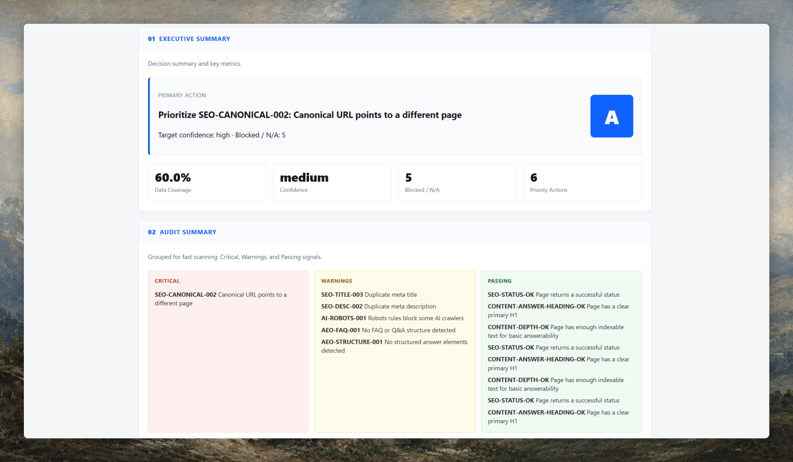
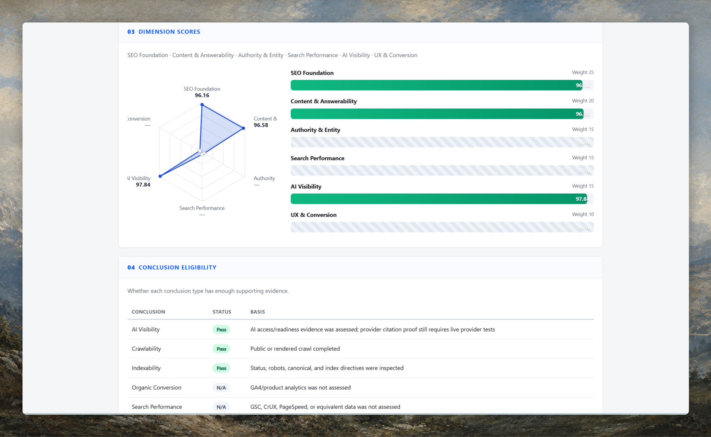
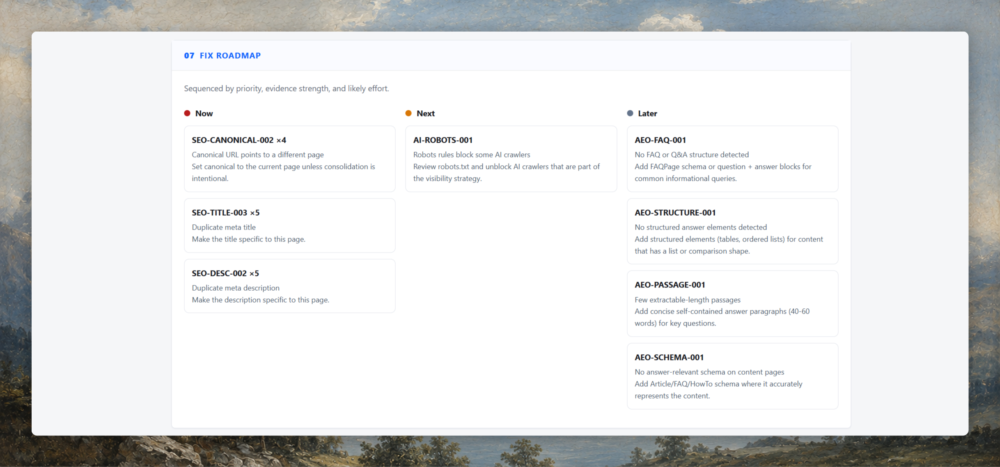

# Website SEO Audit

Production-oriented Agent Skill and Python CLI for evidence-based SEO, technical SEO, AEO, GEO, AI readiness, and search readiness audits.

It is designed for agent workflows that need structured, evidence-bounded reports instead of loose website critique. The tool crawls public/source signals, normalizes Findings, scores only assessed evidence, and generates JSON, Markdown, and HTML reports.

## Showcase

<video width="100%" height="auto" controls autoplay loop muted>
  <source src="https://raw.githubusercontent.com/jonbrown66/website-seo-skill/main/website-seo-audit-promo/website-seo-audit-promo.mp4" type="video/mp4">
  Your browser does not support the video tag.
</video>

## Installation

### Option 1: Install as an Agent Skill

Install the skill from this GitHub repository:

```bash
npx skills add jonbrown66/website-seo-skill

# If your skill installer supports selecting a sub-skill/path:
npx skills add jonbrown66/website-seo-skill --skill website-seo-audit
```

For Codex skill installs from a GitHub repository, install the repository path that contains this `SKILL.md` folder, then restart Codex so the skill metadata is reloaded.

### Option 2: Local Development / CLI

```bash
cd website-seo-skill
python -m pip install -e ".[dev]"
```

The package also exposes a local CLI:

```bash
website-seo-audit audit --url https://example.com --mode quick --max-pages 10 --output ./reports
```

## Usage

Use it as an agent skill:

```text
Use $website-seo-audit to audit https://example.com
```

Example requests:

```text
Audit this site for SEO and AI search readiness: https://example.com
Run a quick public SEO readiness scan for https://example.com
Review this local project for pre-launch SEO readiness: ./my-site
Compare these two audit score files and summarize regressions
```

## Screenshots

### Executive Summary



### Dimension Scores



### Fix Roadmap



## Requirement Understanding

This project is not an LLM-only website critique prompt. It collects deterministic facts, normalizes them into Findings, scores assessed evidence with a rule engine, and uses narrative only for explanation and fix prompts. Missing integrations are marked `not_assessed`, never scored as zero.

Current scope is an MVP readiness auditor. It can assess public/source signals and generate structured reports, but it does not yet prove rankings, traffic, conversions, Core Web Vitals, backlinks, or AI citations unless verified evidence is supplied and captured.

## Architecture

Adapter -> Normalizer -> Rule Engine -> Scoring Engine -> Report Engine.

- `adapters/`: collect data and degrade independently.
- `models.py`: canonical Finding and adapter result structures.
- `rules.py`: deterministic checks and evidence generation.
- `scoring.py`: weighted, coverage-aware scoring.
- `reporting.py`: JSON, Markdown, HTML, fix prompts, raw adapter output.
- `security.py`: SSRF, path traversal, HTML escaping, secret redaction.

## MVP Implemented

- Domain crawl with robots-aware mode.
- Sitemap discovery.
- Meta title and description checks.
- Canonical checks.
- Heading checks.
- Internal/external link extraction.
- JSON-LD presence and syntax validation.
- Basic content depth checks.
- Image alt checks.
- Finding Schema.
- Multi-dimensional scoring.
- Data coverage and confidence.
- Markdown, JSON, HTML reports.
- Fix prompts.
- Before/after score comparison.
- Adapter failure degradation.
- SSRF and secret protection.
- Zero-config browser evidence capture through a fixed Chrome/CDP profile when readable GSC, GA4, or Bing pages are available.

## Current Mode Boundaries

| Mode | What it currently does | What remains unavailable |
| --- | --- | --- |
| `quick` | Deterministic public URL readiness checks and reports | JS rendering, real PageSpeed/CrUX, rankings, traffic, conversions |
| `standard` | Quick checks plus standard reporting envelope | Competitor crawling and live AI citation execution |
| `verified` | Quick/standard plus unavailable placeholders for authorized modules | GSC API, GA4 API, real PageSpeed/CrUX unless captured externally |
| `full` | Broadest report envelope with unsupported modules marked `not_assessed` | Backlinks, logs, live AI providers, historical store, native PDF |
| `audit-zero` | Public/source checks plus browser/CDP evidence capture when signed-in pages can be read | API-grade exports unless downloaded or parsed |

## Not Implemented Yet

- JavaScript rendering.
- Real PageSpeed/CrUX metrics.
- GSC and GA4 integrations.
- Backlink providers.
- Server/CDN logs.
- Live AI citation providers.
- Competitor analysis.
- Historical regression store.
- Native PDF rendering.
- Automatic production code modification.

## CLI Commands

```bash
python -m search_visibility_auditor audit --url https://example.com --mode quick --max-pages 10 --output ./reports
python -m search_visibility_auditor audit-zero --url https://example.com --source-path ./site --output ./reports
python -m search_visibility_auditor validate --report ./reports/<audit-id>/audit.json
python -m search_visibility_auditor compare --baseline ./reports/a/scores.json --current ./reports/b/scores.json --output ./reports/compare.json
```

## Data Truth Rules

- Every score deduction must reference a Finding with evidence.
- Missing integrations reduce coverage, not score.
- Quick Scan is public readiness only.
- Readiness is not visibility. A crawlable, structured page is not proof of traffic or AI citations.
- Reports must not contain secrets or unescaped HTML.
- Recommendations must include affected URL, impact, steps, and validation.

## Risk Notes

The crawler is intentionally conservative and uses stdlib HTML parsing. It is suitable for MVP evidence collection, not a replacement for browser rendering or enterprise crawlers. The scoring rubric is versioned but should be calibrated against real audits before client-facing benchmarking.

## Roadmap

1. Add browser rendering and PageSpeed/CrUX.
2. Add GSC, GA4, SearchStack, GEO Optimizer, SEOmator, backlinks, and AI citation providers.
3. Add trend storage, regression thresholds, and native PDF rendering.
4. Add GitHub/CMS analysis and user-confirmed patch generation.
